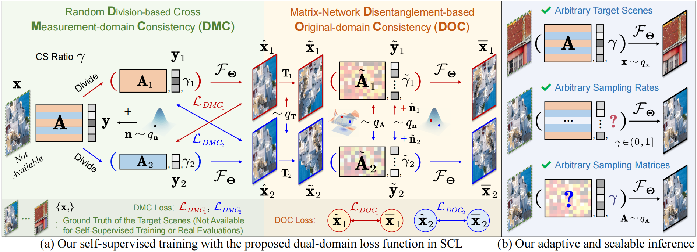
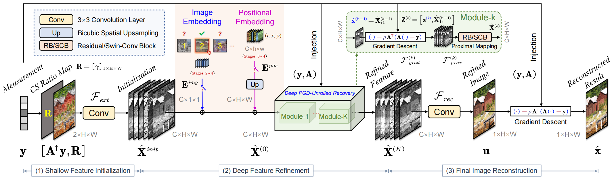
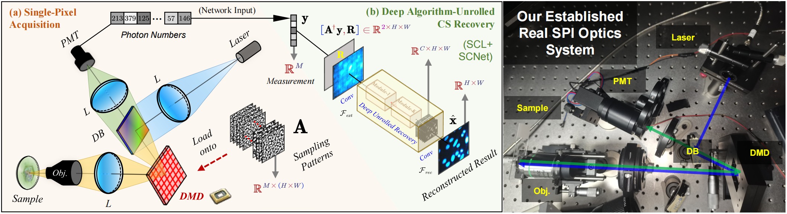

# Self-Supervised Scalable Deep Compressed Sensing (IJCV 2024) [PyTorch]

[](https://arxiv.org/abs/2308.13777) 

[Bin Chen](https://scholar.google.com/citations?hl=en&user=aZDNm98AAAAJ), [Xuanyu Zhang](https://xuanyuzhang21.github.io/), Shuai Liu, [Yongbing Zhang](https://scholar.google.com/citations?user=0KlvTEYAAAAJ), and [Jian Zhang](https://jianzhang.tech/)†

*School of Electronic and Computer Engineering, Peking University, Shenzhen, China.*

*Tsinghua Shenzhen International Graduate School, Tsinghua University, Shenzhen, China.*

*School of Computer Science and Technology, Harbin Institute of Technology (Shenzhen), Shenzhen, China.*

† Corresponding author

Accepted for publication in [International Journal of Computer Vision](https://link.springer.com/journal/11263) (IJCV) 2024.

## Abstract

Compressed sensing (CS) is a promising tool for reducing sampling costs. Current deep neural network (NN)-based CS approaches face the challenges of collecting labeled measurement-ground truth (GT) data and generalizing to real applications. This paper proposes a novel **S**elf-supervised s**C**alable deep CS method, comprising a deep **L**earning scheme called **SCL** and a family of **Net**works named **SCNet**, which does not require GT and can handle arbitrary sampling ratios and matrices once trained on a partial measurement set. Our SCL contains a dual-domain loss and a four-stage recovery strategy. The former encourages a cross-consistency on two measurement parts and a sampling-reconstruction cycle-consistency regarding arbitrary ratios and matrices to maximize data utilization. The latter can progressively leverage the common signal prior in external measurements and internal characteristics of test samples and learned NNs to improve accuracy. SCNet combines both the explicit guidance from optimization algorithms and the implicit regularization from advanced NN blocks to learn a collaborative signal representation. Our theoretical analyses and experiments on simulated and real captured data, covering 1-/2-/3-D natural and scientific signals, demonstrate the effectiveness, superior performance, flexibility, and generalization ability of our method over existing self-supervised methods and its significant potential in competing against many state-of-the-art supervised methods. Code is available at https://github.com/Guaishou74851/SCNet.

## Overview







## Environment

```shell
torch.__version__ == '2.2.1+cu121'
numpy.__version__ == '1.24.4'
skimage.__version__ == '0.21.0'
```

## Test

```shell
python test.py --max_ratio=0.1/0.3/0.5 --testset_name=Set11/CBSD68/Urban100/DIV2K
```

The reconstructed images will be in `./result`.

## Train

Download [Training_Data.mat](https://drive.google.com/file/d/14CKidNsC795vPfxFDXa1FH9QuNJKE3cp) and put it into `./data`, then run:

```shell
python train.py --max_ratio=0.1/0.3/0.5
```

The log and model files will be in `./log` and `./weight`, respectively.

## Citation

If you find the code helpful in your research or work, please cite the following paper:

```latex
@article{chen2024self,
title={Self-Supervised Scalable Deep Compressed Sensing},
  author={Chen, Bin and Zhang, Xuanyu and Liu, Shuai and Zhang, Yongbing and Zhang, Jian},
  journal={International Journal of Computer Vision},
  year={2024},
}
```